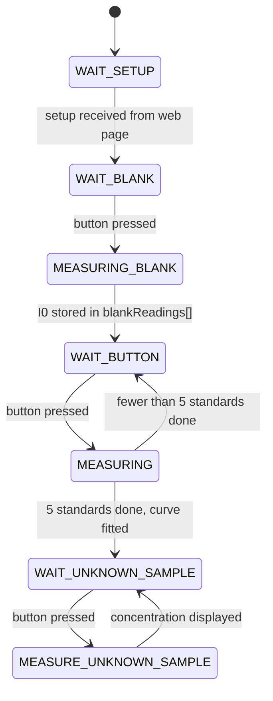

# Smart-Sense

An open-source, low-cost, 3D-printed **absorbance photometer (colorimeter)** built around an
ESP32-S3 microcontroller and an AS7341 multi-channel spectral sensor.

You put a standard cuvette in the well, press a button, and the device does what a benchtop
colorimeter does: it measures a blank, measures five standards of known concentration, fits a
calibration curve (Beer–Lambert), and then reports the concentration of unknown samples — at up to
**8 wavelengths simultaneously** (415, 445, 480, 515, 555, 590, 630 and 680 nm).

Everything is configured from a web page served by the device itself. No app, no cables, no
software to install on your phone or laptop *after* the device is built.

> **This guide assumes no electronics or programming experience.** If you can follow a lab
> protocol, you can follow this. The only step that involves a computer is Part 2 (flashing), and it
> is a copy-and-click procedure.

---

## Contents

- [What you need](#what-you-need)
- [Part 1 — Printing the parts](#part-1--printing-the-parts)
- [Part 2 — Putting the code into the ESP32 (flashing)](#part-2--putting-the-code-into-the-esp32-flashing)
- [Part 3 — Using the device](#part-3--using-the-device)
- [Part 4 — How the code works](#part-4--how-the-code-works)
- [Known limitations](#known-limitations)
- [License](#license)

---

## What you need

### Electronics

| Item | Notes |
|---|---|
| **Adafruit Feather ESP32-S3 Reverse TFT** (PID 5691) | The brain + the 240×135 colour screen + the three buttons. The firmware is compiled specifically for this board. |
| **Adafruit AS7341 10-Channel Light/Color Sensor breakout** (PID 4698) | The detector. It also carries the white LED used as the light source. |
| **STEMMA QT / Qwiic cable** (JST-SH 4-pin) | Connects the sensor to the Feather. Both boards have the connector, so **no soldering is required**. |
| **USB-C cable capable of carrying data** | Needed once, to flash the firmware. See the warning in [Part 2](#step-5--connect-the-board). |
| *(optional)* 3.7 V LiPo battery with JST-PH connector | Makes the device portable. Not required. |

### Consumables

| Item | Notes |
|---|---|
| **Standard cuvettes, 12.5 × 12.5 mm outside, 10 mm path length** | The well in the printed case measures **12.7 mm square**, i.e. a standard cuvette plus 0.2 mm clearance. Plastic (PMMA/PS) cuvettes are fine for visible-range work. |

### Hardware

| Item | Notes |
|---|---|
| 4 × M3 self-tapping screws, 8–10 mm | The mounting holes in the printed parts are **Ø2.8 mm**, so a thread-forming M3 screw cuts its own thread in the plastic. M2.5 machine screws also work. |

### Tools

- A **3D printer** (FDM/filament, any common model) — or access to a printing service.
- A **computer running Windows, macOS or Linux** for the flashing step.

---

## Part 1 — Printing the parts

All three files are in the [`3D PIECES TO PRINT/`](3D%20PIECES%20TO%20PRINT) folder. Print **one of
each**.

| File | What it is | Size (mm) | Supports? |
|---|---|---|---|
| [`espCase.stl`](3D%20PIECES%20TO%20PRINT/espCase.stl) | Main body: holds the electronics and contains the cuvette well | 78.8 × 67.1 × 50.0 | **Yes** |
| [`bottomPlate.stl`](3D%20PIECES%20TO%20PRINT/bottomPlate.stl) | Flat lid that closes the bottom of the body | 78.9 × 69.1 × 2.0 | No |
| [`screenCover.stl`](3D%20PIECES%20TO%20PRINT/screenCover.stl) | Thin frame that sits over the display | 60.8 × 32.9 × 3.0 | No |

Total print time is roughly **5–7 hours** and uses about **80–110 g** of filament, depending on
your printer and settings.

### ⚠️ The single most important printing rule

**Print in opaque black filament.**

This is not cosmetic. The device measures how much light a sample absorbs. Any light that leaks
through the walls of the case and reaches the sensor without passing through the cuvette is *stray
light*, and stray light makes absorbance readings read low and non-linear at high concentrations —
exactly where you least want an error.

Concretely:
- Use **black** PLA or PETG. Not white, not natural, not translucent, not "galaxy" or sparkle.
- Use at least **3 perimeters (walls)** and **4 top/bottom layers** so the shell is genuinely
  light-tight.
- Use at least **20 % infill**. Higher is fine.

If you hold the finished body up to a bright lamp and can see any glow through the walls, print it
again with more walls.

### Recommended slicer settings

These work in Cura, PrusaSlicer, Bambu Studio, Orca — any slicer.

| Setting | Value |
|---|---|
| Material | PLA (easiest) or PETG (more heat-resistant) |
| Colour | **Black, opaque** |
| Layer height | 0.2 mm |
| Walls / perimeters | 3 or more |
| Top / bottom layers | 4 or more |
| Infill | 20–30 % |
| Supports | **Only for `espCase.stl`** — "support on build plate only" is enough |
| Brim | Optional; helps if your bed adhesion is marginal |
| Nozzle | 0.4 mm (standard) |

### ⚠️ Orient the parts before slicing

`espCase.stl` and `bottomPlate.stl` were exported **tilted 30° relative to the build plate**. If you
drop them into the slicer and hit "slice" without looking, they will print leaning over, need
enormous amounts of support, and come out badly.

Fix it in one click:

1. Load the part.
2. Use your slicer's **"Place on face"** tool (Cura: `Lay flat` / `Place on face`;
   PrusaSlicer and Orca: `Place on face`, keyboard shortcut `F`).
3. Click the **large flat face** of the part — for `espCase.stl` this is the big open bottom, for
   `bottomPlate.stl` it is either of the two large flat faces.

If your slicer has no such tool, rotate the part **+30° around the X axis** manually. When it is
correct, the reported height will be **50.0 mm** for `espCase.stl` and **2.0 mm** for
`bottomPlate.stl`.

`screenCover.stl` is already flat and needs no rotation — just lay it with its large flat face down.

### After printing

- Check that the **cuvette well is clear**. It should be a clean 12.7 mm square opening; a cuvette
  should slide in with a light friction fit and no rocking. Remove any support material or stringing
  from inside it with a hobby knife.
- Check that the **light-path openings** — the small windows in the walls on either side of the
  well — are clear and square. The LED shines in through one side and the sensor looks in from the
  other, so any debris or stringing here corrupts your readings directly.
- Do **not** sand or polish the inside of the case. A matte black interior is what you want.

---

## Part 2 — Putting the code into the ESP32 (flashing)

"Flashing" just means copying the program onto the microcontroller. You do it once. After that the
device runs standalone, and you never need the computer again.

We use **Visual Studio Code** (a free code editor from Microsoft) plus **PlatformIO** (a free
extension that handles compilers and libraries automatically). PlatformIO downloads everything else
it needs by itself.

> **Time required:** about 10 minutes of clicking, plus 5–15 minutes of unattended downloading the
> first time.

### Step 1 — Install Visual Studio Code

1. Go to **<https://code.visualstudio.com/>**.
2. Download the installer for your operating system and run it.
3. Accept the defaults. On Windows, ticking *"Add to PATH"* is helpful but not required.

### Step 2 — Install the PlatformIO extension

1. Open Visual Studio Code.
2. On the left-hand vertical bar, click the **Extensions** icon (four small squares, or press
   `Ctrl+Shift+X` — `Cmd+Shift+X` on macOS).
3. Type **`PlatformIO IDE`** in the search box.
4. Click **Install** on the entry published by *PlatformIO*.
5. Wait. The first install pulls down a Python environment and takes several minutes. A progress
   notification appears in the bottom-right corner.
6. **Restart VS Code** when it asks you to. When PlatformIO is ready, a small **ant/alien head icon**
   appears in the left-hand bar and a **house icon** appears in the blue status bar at the bottom.

### Step 3 — Download this project

**Option A (no Git needed):**
1. On the project's GitHub page, click the green **`Code`** button → **`Download ZIP`**.
2. Unzip it somewhere easy to find, e.g. your Desktop or Documents folder.

**Option B (if you have Git installed):**

```bash
git clone https://github.com/Smart-UFU/Smart-Sense.git
```

> **Avoid folder names with accents, spaces or special characters** in the full path
> (`C:\Users\João\Área de Trabalho\...`). The compiler toolchain occasionally chokes on them. A path
> like `C:\Smart-Sense` is safest.

### Step 4 — Open the project (this is where most people go wrong)

You must open the **`CODE`** folder — **not** the top-level `Smart-Sense` folder.

PlatformIO recognises a project by the presence of a `platformio.ini` file, and that file lives
inside `CODE/`.

1. In VS Code: **File → Open Folder…**
2. Navigate into `Smart-Sense` and select the folder named **`CODE`**.
3. Click **Select Folder** / **Open**.
4. If VS Code asks *"Do you trust the authors of the files in this folder?"*, click **Yes, I trust
   the authors** — otherwise PlatformIO cannot run.

You will know it worked when the blue status bar at the bottom of the window grows extra icons: a
**✓ (checkmark)**, a **→ (right arrow)**, a **🗑 (trash can)** and a **🔌 (plug)**.

**The first time you open it, PlatformIO will download the ESP32 compiler toolchain and the four
required libraries.** This is several hundred megabytes and can take 5–15 minutes on a normal
connection. Let it finish — the progress appears in the terminal panel at the bottom. You need an
internet connection for this step only.

### Step 5 — Connect the board

Plug the Feather into your computer with a **USB-C cable**.

> ⚠️ **The most common failure in this whole guide is a charge-only USB cable.** Many cheap USB-C
> cables (especially the ones bundled with phone chargers and power banks) carry power but no data.
> The board will light up and appear dead to the computer. If nothing is detected, **try a different
> cable first** before doing anything else.

The ESP32-S3 has native USB, so on Windows 10/11, macOS and Linux **no driver installation is
normally needed**. The board shows up on its own.

### Step 6 — Build and upload

1. Click the **✓ (checkmark)** icon in the bottom status bar. This is **Build** — it compiles the
   code without sending anything to the board. Wait for a green `SUCCESS` message in the terminal.
   (First build: a few minutes. Later builds: seconds.)
2. Click the **→ (right arrow)** icon. This is **Upload** — it compiles *and* copies the program to
   the board.
3. Watch the terminal. You want to see something like:

   ```
   Writing at 0x00010000... (100 %)
   Wrote 1048576 bytes ...
   Hash of data verified.
   Leaving...
   ================= [SUCCESS] Took 42.11 seconds =================
   ```

4. The screen on the Feather lights up and shows:

   ```
   Access the web
   interface at:
   192.168.4.1
   to send a setup
   ```

That's it. The device is programmed. **Unplug it from the computer** — from now on it runs from USB
power, a phone charger, a power bank or a LiPo battery.

### Troubleshooting

| Symptom | What to do |
|---|---|
| No COM port / no serial device found | Try a different USB-C cable (see the warning above). Then try a different USB port, preferably directly on the computer rather than through a hub. |
| `A fatal error occurred: Could not open ...` or upload just hangs | Put the board into bootloader mode by hand: **hold the `BOOT` button down, press and release `RESET`, then release `BOOT`.** Click Upload again immediately. Press `RESET` once when it finishes. |
| `Please specify 'upload_port'` | Several serial devices are present and PlatformIO cannot guess. Find the right port (Windows: Device Manager → Ports; macOS/Linux: `ls /dev/tty.*`) and add a line `upload_port = COM7` (or `/dev/ttyACM0`) under `[env:...]` in [`CODE/platformio.ini`](CODE/platformio.ini). |
| Library download fails / `HTTPClientError` | Check your internet connection and any corporate proxy or firewall, then run Build again. PlatformIO resumes where it left off. |
| Build fails immediately with "no project found" | You opened the wrong folder. Go back to [Step 4](#step-4--open-the-project-this-is-where-most-people-go-wrong) and open `CODE`, not `Smart-Sense`. |
| Screen stays black after upload | Press the `RESET` button on the Feather once. |
| Screen shows a red `Failed to initialize AS7341` | The sensor is not being seen over I²C. Check that the STEMMA QT cable is fully clicked into **both** boards. The firmware retries forever, so it recovers on its own once the cable is seated. |

---

## Part 3 — Using the device

Here is a full session, from power-on to a concentration reading.

### 1. Power on

Plug in USB power (or a battery). The screen shows the address of the built-in web interface,
normally `192.168.4.1`.

### 2. Connect to the device's Wi-Fi

The device creates its own Wi-Fi network. On your phone or laptop, connect to:

| | |
|---|---|
| **Network name (SSID)** | `Smart_Sense_Network` |
| **Password** | `smarteza` |

Your phone may warn you that this network has no internet access. That is expected — accept and stay
connected.

### 3. Open the configuration page

Open any browser and go to **<http://192.168.4.1>** (type the address exactly; do not search for
it).

You will see the Smart Sense setup form.

### 4. Fill in the setup

| Field | What to enter |
|---|---|
| **Gain** | Sensor amplification, 1× to 512×. Start with **64×**. |
| **LED current** | Brightness of the light source, 4–258 mA. Start with **50–100 mA**. |
| **First…Fifth Concentration** | The five known concentrations of your calibration standards, **in ascending order**, in whatever unit you like (mol/L, mg/L, ppm…). The device does not care about the unit — it reports the answer in the same one. Use a **decimal point**, not a comma. |
| **Channel selection** | The wavelength(s) you want to measure at. Pick the one closest to your analyte's λ<sub>max</sub>. |

**Selecting more than one wavelength:** hold `Ctrl` (Windows/Linux) or `Cmd` (macOS) while clicking,
or tap multiple entries on a phone. **You must select at least one** — if you select none, the
device will run through the whole procedure and display nothing.

The eight available channels:

| Channel | Wavelength | Colour it responds to |
|---|---|---|
| F1 | 415 nm | violet |
| F2 | 445 nm | indigo |
| F3 | 480 nm | blue |
| F4 | 515 nm | cyan/green |
| F5 | 555 nm | green |
| F6 | 590 nm | yellow |
| F7 | 630 nm | orange |
| F8 | 680 nm | red |

> Remember the complementary-colour rule: a **blue** solution absorbs in the **orange/red**, so you
> would measure it at 630 nm, not 480 nm.

Press **Send Setup**. The screen changes to `Setup OK`.

### 5. Run the blank (reference)

The screen asks you to *insert reference and press the button*.

1. Fill a cuvette with your **blank** — pure solvent, or the full reagent mixture without the
   analyte.
2. Put it in the well.
3. Press the **button labelled `D1`** on the Feather (the middle of the three buttons on the front
   edge).

The device takes 20 readings and stores the result as *I₀*. This takes roughly **10–15 seconds** per
measurement; the screen counts the readings as they happen.

### 6. Run the five standards

The screen asks for sample 1. For each of the five standards, in the **same order as the
concentrations you typed into the web form**:

1. Insert the cuvette.
2. Press `D1`.
3. Wait. The device shows the absorbance it calculated for each selected channel, for 3 seconds
   each.

After the fifth standard, the device fits the calibration line and displays, one channel at a time
for 5 seconds each:

```
Ch 630
a: 0.8412      <- slope
b: 0.0091      <- intercept
```

> 📝 **Write these numbers down.** They exist only in RAM and only on that screen. There is no
> logging, and cutting the power erases them.

### 7. Measure unknowns

The screen asks you to press the button for an unknown sample. Insert your unknown, press `D1`, and
after the measurement the device shows:

```
Ch 630 : 0.0247
```

That is the concentration, in the same unit you used for the standards, held on screen for 10
seconds.

You can keep measuring unknowns indefinitely — the device loops back to the "press the button for
another unknown sample" prompt. The calibration stays valid until you power the device off.

### Good practice for reliable numbers

- **Always insert the cuvette the same way round.** Cuvette walls are not perfectly identical; mark
  one face and keep it facing the LED.
- **Wipe the optical faces** of the cuvette with a lint-free tissue before every reading. A
  fingerprint is a large absorbance error.
- **Keep absorbances between about 0.1 and 1.0.** Below that, noise dominates; above it, the
  response goes non-linear. If your absorbances are too high, dilute. If they are too low, increase
  the gain and re-run the whole calibration.
- **Re-run the blank whenever you change gain, LED current, or wavelength.** All of those change
  what *I₀* means, so the old calibration is invalid.
- **Let the device warm up** for a minute or two before the blank. LED output drifts slightly as it
  heats.
- **Keep the lid on / room light constant.** This is a single-beam instrument with no dark-current
  correction; it cannot tell your analyte from the ceiling lights.

---

## Part 4 — How the code works

Everything lives in [`CODE/`](CODE):

| File | Role |
|---|---|
| [`platformio.ini`](CODE/platformio.ini) | Build configuration: which board, which framework, which libraries. |
| [`src/main.cpp`](CODE/src/main.cpp) | The entire firmware — sensor control, display, state machine, maths, web server. |
| [`include/webPage.h`](CODE/include/webPage.h) | The configuration web page (HTML + CSS + JavaScript) stored as one big string constant compiled into the firmware. |

### The build configuration

[`platformio.ini`](CODE/platformio.ini) declares the target board as
`adafruit_feather_esp32s3_reversetft`. That single line is what makes names like `TFT_CS`,
`TFT_BACKLITE` and `TFT_I2C_POWER` resolve to the correct pins — they come from the board definition,
not from the source code. **This is why the firmware will not work as-is on a different ESP32
board.**

It also pulls in four libraries automatically:

| Library | Purpose |
|---|---|
| `Adafruit ST7735 and ST7789 Library` | Drives the 240×135 colour display |
| `Adafruit AS7341` | Talks to the spectral sensor over I²C |
| `ESPAsyncWebServer` | Serves the configuration page without blocking the measurement loop |
| `ArduinoJson` | Declared as a dependency (the current code builds its JSON replies by hand) |

### Startup — `setup()`

[`main.cpp:81`](CODE/src/main.cpp#L81) runs once at power-on and does four things:

1. **Starts a Wi-Fi access point** (`WiFi.softAP`) named `Smart_Sense_Network`. The device *is* the
   network; it never joins yours. This is why it works in a lab with no infrastructure.
2. **Wakes up the display**: powers the backlight (`TFT_BACKLITE`) and the TFT/I²C power rail
   (`TFT_I2C_POWER` — on this board the sensor bus is switched, so forgetting this leaves the sensor
   invisible), then initialises a 135×240 panel rotated to landscape.
3. **Initialises the AS7341** in a `while(!as7341.begin())` loop — it retries forever and prints a
   red error rather than giving up, so plugging the cable in late still works.
   It then sets `ATIME = 100` and `ASTEP = 999`, which gives an integration time of
   `(100+1) × (999+1) × 2.78 µs ≈ 281 ms` per integration. Longer integration = more light collected
   = better signal-to-noise, at the cost of speed.
4. **Registers the web routes and starts the server.**

The button on GPIO 1 is configured as `INPUT_PULLDOWN` and read as active-**HIGH**, which matches the
`D1` button built into the Reverse TFT Feather.

### The web interface

Two routes are registered in `setupWebRoutes()` ([`main.cpp:406`](CODE/src/main.cpp#L406)):

- **`GET /`** returns the page from `webPage.h`.
- **`GET /setup?gain=…&current=…&concentration1=…&…&channels=415,630`** receives the configuration.

The handler rejects the request with HTTP 400 if any parameter is missing, stores the gain, LED
current and the five concentrations, then splits the comma-separated `channels` string into
`selectedChannels[]`.

It then calls `configureSensor()` ([`main.cpp:380`](CODE/src/main.cpp#L380)), which validates the LED
current against the 4–258 mA hardware range and maps the gain number onto the library's
`AS7341_GAIN_*` enum. If either is invalid the endpoint answers HTTP 500 and the device stays
waiting. Only on success does it set `config.isValid = true` — the single flag the main loop is
watching.

### The measurement state machine

`loop()` ([`main.cpp:98`](CODE/src/main.cpp#L98)) is not a linear program. It is a state machine:
every pass through the loop, it looks at `measureState` and does the small piece of work that state
calls for. This is what lets the web server stay responsive while the device waits for a button
press.



Note the last transition: after an unknown sample the device returns to
`WAIT_UNKNOWN_SAMPLE`, never back to calibration. One calibration, unlimited unknowns.

### Taking one reading — `performSingleMeasurement()`

[`main.cpp:232`](CODE/src/main.cpp#L232) is the heart of the instrument, and it is the same routine
for the blank, the standards and the unknowns:

1. **Turn the LED on** and wait 100 ms for it to stabilise.
2. **Take 20 complete readings** of all channels (`READINGS_PER_SAMPLE = 20`), 50 ms apart.
3. For each reading, **pick out only the channels you selected.** The sensor's `readAllChannels()`
   returns 12 values, and the mapping is not a straight 0–7 — the array contains duplicated
   clear/NIR entries in the middle. The `switch` statement handles this:

   | Wavelength | Index in the raw array |
   |---|---|
   | 415 nm (F1) | 0 |
   | 445 nm (F2) | 1 |
   | 480 nm (F3) | 2 |
   | 515 nm (F4) | 3 |
   | 555 nm (F5) | **6** |
   | 590 nm (F6) | **7** |
   | 630 nm (F7) | **8** |
   | 680 nm (F8) | **9** |

4. **Turn the LED off** — important, because leaving it on would heat the sensor and shift readings.
5. **Reduce the 20 readings per channel to one number** via `calculateAverage()`.

The whole routine takes roughly **10–15 seconds**, most of it spent on the 20 integrations.

### Why the average is not a plain average — `calculateAverage()`

[`main.cpp:452`](CODE/src/main.cpp#L452) does something more careful than adding up 20 numbers and
dividing by 20. It:

1. **Sorts** the 20 readings from smallest to largest,
2. **Discards the bottom quarter and the top quarter** (indices 0–4 and 15–19),
3. **Averages the middle 10 only.**

This is an **interquartile (trimmed) mean**. A single bubble in the cuvette, a flicker in the LED, or
a stray reflection produces one wild reading; a plain mean would carry that error into your result,
while a trimmed mean throws it away entirely. It is the same reasoning behind discarding outliers in
a set of titration replicates.

### From counts to absorbance

The sensor reports raw counts — a number proportional to how much light hit it — not absorbance. The
conversion is the Beer–Lambert law, applied at [`main.cpp:153`](CODE/src/main.cpp#L153):

$$A = -\log_{10}\left(\frac{I}{I_0}\right)$$

where **I₀** is the blank reading (`blankReadings[]`) and **I** is the sample reading. The guard
`if (blankReadings[i] > 0 && sampleResults[i] > 0)` prevents a division by zero or a logarithm of
zero from producing garbage; in that case absorbance is recorded as 0.

This is done independently for each channel you selected, so measuring at four wavelengths gives you
four independent absorbance values from one press of the button.

### Fitting the calibration curve

Once the fifth standard is measured, `calculateLinearRegressionPerChannel()`
([`main.cpp:277`](CODE/src/main.cpp#L277)) performs a **least-squares linear regression** for each
channel separately, with

- **x = concentration** (the five values you typed into the web page)
- **y = absorbance** (the five values the device just measured)

producing the familiar line

$$A = a \cdot C + b$$

using the standard closed-form expressions

$$a = \frac{n\sum xy - \sum x \sum y}{n\sum x^2 - (\sum x)^2}, \qquad b = \frac{\sum y \sum x^2 - \sum x \sum xy}{n\sum x^2 - (\sum x)^2}$$

The slope **a** is the analytical sensitivity (and, if your concentrations are in mol/L and your path
length is 1 cm, it is the molar absorptivity ε). The intercept **b** should be close to zero for a
well-behaved blank — a large intercept is a hint that something is wrong with your blank or that
stray light is reaching the sensor.

The coefficients are stored in `a_reg[]` and `b_reg[]` and displayed by
`showRegressionsOnDisplay()`.

### Back to concentration

For an unknown sample, [`main.cpp:206`](CODE/src/main.cpp#L206) measures its absorbance the same way
and then inverts the calibration line:

$$C = \frac{A - b}{a}$$

with a guard against `a == 0` (which would mean the calibration failed — for example, five standards
that all read the same absorbance).

### Numbers you might want to change

| What | Where | Effect |
|---|---|---|
| Wi-Fi name and password | [`main.cpp:19-20`](CODE/src/main.cpp#L19) | Useful if several devices run in the same room |
| Readings averaged per measurement | `READINGS_PER_SAMPLE`, [`main.cpp:56`](CODE/src/main.cpp#L56) | More = slower but less noisy |
| Integration time | `setATIME` / `setASTEP`, [`main.cpp:350`](CODE/src/main.cpp#L350) | More = more light collected per reading |
| Number of calibration standards | Hard-coded as **5** in several places | Changing it requires editing the web page, the `MeasurementConfig` struct, the regression function and the loop counter together |

After any edit, repeat [Step 6](#step-6--build-and-upload) — Build, then Upload.

---

## Known limitations

Stated plainly, so you know what this instrument is and is not:

- **Nothing is saved.** Calibration coefficients and results live in RAM. Power off, and they are
  gone. Photograph the screen or write the numbers down.
- **Results appear only on the small display.** There is no data logging, no CSV export, and no
  results page in the web interface — the web page is for input only.
- **Exactly five calibration standards**, no more, no fewer. There is no way to skip a standard or
  add a sixth without editing the code.
- **No goodness-of-fit statistic.** The device reports the slope and intercept but not R², so it
  cannot tell you that your calibration was poor. Plot your five points yourself if the numbers look
  strange.
- **No dark-current / ambient-light correction.** The blank is measured with the LED on, so it
  includes ambient light at that moment. If room lighting changes between the blank and the sample,
  the reading shifts. Keep conditions constant.
- **Single beam.** LED drift between the blank and a later sample appears directly as an error.
  Re-blank periodically during long sessions.
- **The channel selector accepts zero channels.** If you forget to select a wavelength, the whole
  procedure runs and displays nothing at the end.
- **The web interface has no authentication.** Anyone within Wi-Fi range who knows the password can
  reconfigure the device. It is designed for a benchtop, not a network.

---

## License

MIT — see [LICENSE](LICENSE). Copyright (c) 2026 Smart-UFU.
